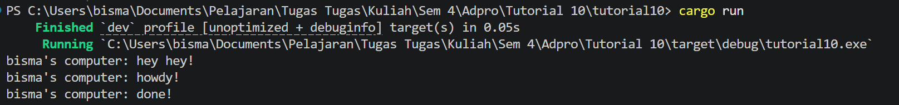

println!("bisma's computer: hey hey!"); muncul lebih dulu karena baris tersebut dijalankan secara langsung oleh thread utama program, sedangkan kode di dalam spawner.spawn(async { ... }) belum langsung dieksekusi saat dipanggil. Ketika spawn dipanggil, async block hanya dibungkus menjadi sebuah Future lalu dimasukkan ke dalam antrean task milik executor. Setelah task dimasukkan ke queue, program langsung melanjutkan eksekusi ke baris berikutnya, yaitu println!("hey hey!"), sehingga output itu tampil terlebih dahulu. Task async baru benar-benar dijalankan ketika executor.run() dipanggil. Executor kemudian mengambil task dari queue, menjalankannya hingga menemukan .await pada TimerFuture. Saat timer belum selesai, future mengembalikan Poll::Pending, sehingga task dihentikan sementara. Setelah thread timer selesai tidur selama 2 detik, waker.wake() dipanggil untuk membangunkan task tersebut agar dijalankan kembali oleh executor. Ketika task dipoll ulang dan timer sudah selesai, future mengembalikan Poll::Ready, lalu eksekusi dilanjutkan ke println!("bisma's computer: done!").
